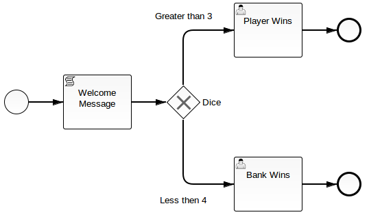

# Scripting everywhere in camunda BPM

This git repository contains a simple example the new scripting features of the
[camunda BPM 7.2.0-alpha3][alpha3] release. Please see the [blog post][] for more informations.

[alpha3]: http://blog.camunda.org/2014/07/camunda-bpm-720-alpha3-released.html
[blog post]: http://blog.camunda.org/2014/07/scripting-everywhere-in-camunda-bpm.html
